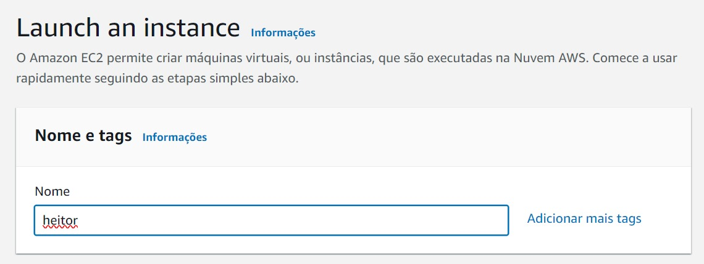
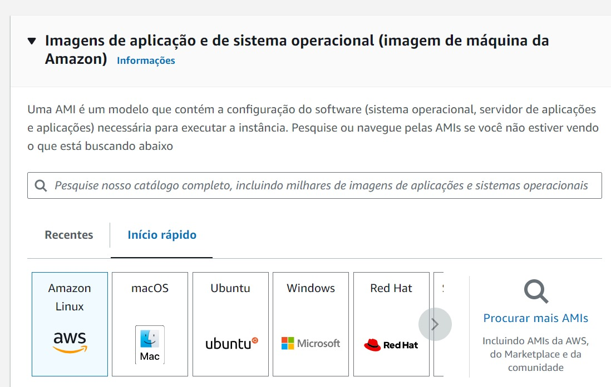

# Ponderada Heitor

## Introdução

Quer saber como é o processo de criação de uma instância de máquina virtual no serviço Amazon Elastic Compute Cloud (EC2)? Está no lugar certo! O Amazon EC2 é uma parte central da plataforma de cloud computing da Amazon Web Services (AWS), oferecendo capacidade de computação redimensionável na nuvem.

## Objetivo

O objetivo deste relatório é documentar as etapas necessárias para lançar uma instância EC2, incluindo a seleção de uma imagem de sistema operacional (AMI), escolha do tipo de instância, configuração de rede e armazenamento, e finalmente, o estabelecimento de uma conexão SSH com a instância criada.

## Materiais

Conta AWS
Console de gerenciamento da AWS
Chave SSH para conexão segura

## Método

**Nomeação da Instância:** O primeiro passo envolve dar um nome à instância para identificação. Esta etapa é ilustrada pelo print com o título "Launch an instance" onde o meu nome 'heitor' é atribuído à instância.

**Seleção de Imagem de Sistema Operacional (AMI):** A escolha de uma AMI é crucial, pois define o sistema operacional e a configuração inicial da instância. O print mostrando diferentes AMIs disponíveis para seleção ilustra essa etapa.

**Escolha do Tipo de Instância:** O próximo passo é selecionar o tipo de instância, que determina os recursos de hardware da máquina virtual. O print que mostra a seleção do tipo de instância "t2.micro" é relevante aqui (Print 3).

**Configuração do Par de Chaves (Login):** Para garantir o acesso seguro à instância, é necessário um par de chaves. O print onde um par de chaves chamado 'ponderada' é selecionado demonstra essa configuração (Print 4).

**Configurações de Rede:** Configurar a rede inclui definir uma Virtual Private Cloud (VPC), sub-redes, e grupos de segurança. O print que mostra a criação de um novo grupo de segurança e as regras de firewall é usado aqui (Print 5).

**Configuração de Armazenamento:** É preciso definir o tamanho e o tipo de armazenamento para a instância. O print que mostra a configuração de um volume de 8 GiB do tipo gp3 se encaixa nesta etapa (Print 6).

## Resultados

Após a configuração e o lançamento da instância, os detalhes da instância, como ID, endereço IP público e privado, e estado da instância são apresentados. O print mostrando a instância em execução e seus detalhes de rede será colocado nesta seção (Print 7).

## Conclusão

A última etapa do processo é estabelecer uma conexão SSH com a instância. Os prints que mostram o prompt de autenticidade do host e a tela de login bem-sucedido da instância Linux serão discutidos aqui para concluir o processo de lançamento da instância EC2 (Prints 8 e 9).

## Referências

OpenAI. ChatGPT. Disponível em: www.chat.openai.com/. Acesso em: 23 fev. 2024.
